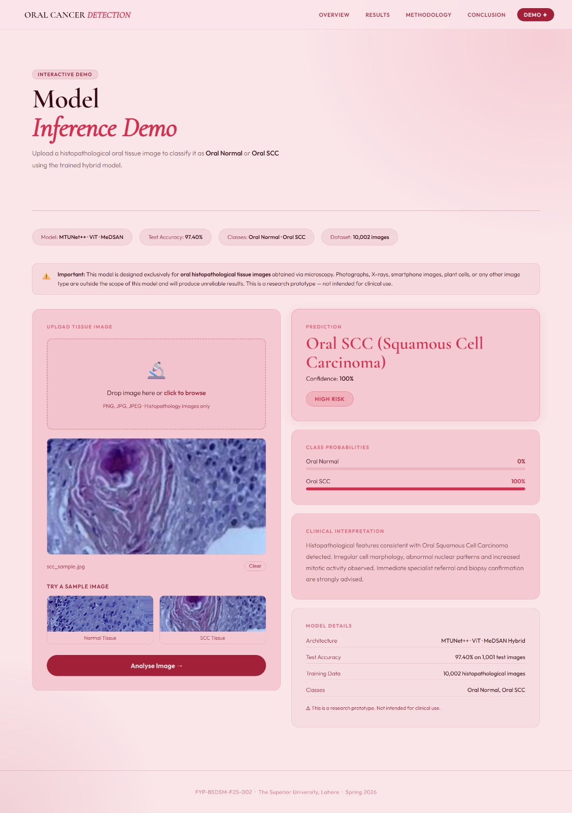

# 🩺 Oral Cancer Detection using Hybrid Parallel Deep Learning

A research-based Final Year Project focused on the classification of Oral Squamous Cell Carcinoma (OSCC) from histopathological tissue images.

## 🚀 Project Demo

---

## Key Highlights

- Hybrid Parallel Deep Learning Architecture
- MTUNet++
- Vision Transformer (ViT)
- MeDSAN Attention Module
- Histopathology Image Classification
- Test Accuracy: **97.40%**

---

## Current Status

🚧 This project is currently under active research and development.

The complete source code, model weights, and dataset are not publicly available at this stage.

---

## Contact

**Fatima Tul Zahra**

**Email:** fatimatulzahra1719@gmail.com
**Linkdin:**  https://www.linkedin.com/in/fatima-tul-zahra-ds/
